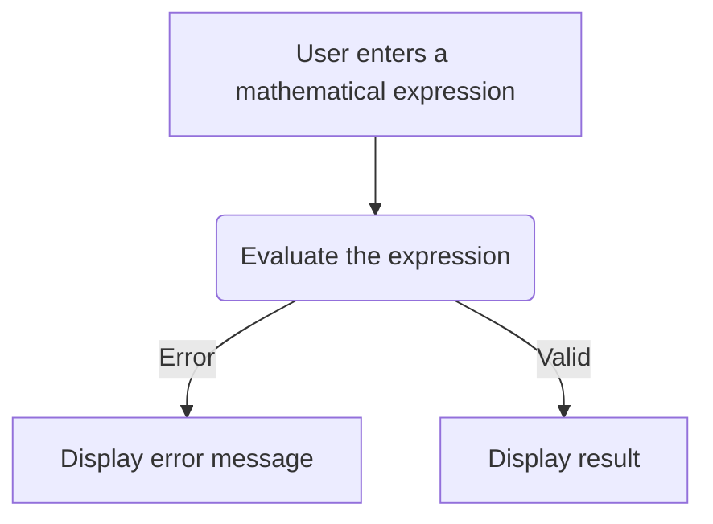

# EeasyCalc

# Calculator App
The calculator app is a program that allows users to perform basic arithmetic operations like addition, subtraction, multiplication, and division. It is built using the Python programming language and a GUI (Graphical User Interface) framework called tkinter. The app's code is divided into two main branches: "functions" and "gui."

## Functions Branch: 
The "functions" branch contains the core logic of the app, including a calculator function that performs the calculations. It uses an atomic model folder structure, which organizes the code into small, independent modules.

This branch is likely where the core mathematical functions that power the calculator's calculations are stored. These might include functions like addition, subtraction, multiplication, and division, as well as more complex functions like logarithms, trigonometric functions, and exponentiation. This branch is likely focused on the "backend" of the calculator's functionality, and may not include any code related to the user interface or graphical elements of the app.

## GUI Branch:
The "gui" branch contains the user interface for the app. It is built using the tkinter framework, which allows for the creation of buttons, text boxes, and other visual elements. The GUI has two pages: the first page where users enter their numbers and select the operation they want to perform, and the second page where the result of the calculation is displayed.

This branch is likely where the code related to the calculator's user interface is stored. This might include things like the layout of the calculator's buttons and display, as well as the code that handles user input and output. The GUI branch is likely focused on the "frontend" of the app's functionality, and may not include any of the mathematical functions used to perform calculations.

## Master Brach:
Finally, the "master" branch combines both the "functions" and "gui" branches to create the complete calculator app. Users can enter two numbers and select the desired operation from the provided buttons, and the calculator will display the result of the calculation. Overall, the calculator app is a simple but powerful tool that provides an efficient means of performing basic arithmetic operations.

The master branch is typically the default branch in a source code repository, and represents the current stable version of the app. This branch may include code from both the Functions and GUI branches, as well as any additional features or bug fixes that have been added since the last release. The master branch is typically the branch that developers will use to create new versions of the app, and is the branch that end users will typically download and use.

## Some Other Description: 
To start using the calculator app, users must first launch it on their device. This can be done by running the Python code from their terminal or through an Integrated Development Environment (IDE) like PyCharm or Visual Studio Code. Once the app is launched, users will see the GUI's first page, which contains two entry fields for entering numbers and a set of buttons for selecting the operation they want to perform. The operations that users can perform include addition, subtraction, multiplication, and division. The calculator function in the "functions" branch uses conditional statements to determine which operation to perform based on the user's selection.

After the user enters their numbers and selects the desired operation, they can click the "calculate" button, which triggers the calculator function to perform the calculation. The result is then displayed on the second page of the GUI, where users can see the result of their calculation. One advantage of using the atomic model folder structure in the "functions" branch is that it allows for modular programming, making it easier to test and debug the code. Additionally, the use of the tkinter framework in the "gui" branch provides an intuitive and user-friendly interface that simplifies the process of performing arithmetic calculations. In summary, the calculator app is a simple yet effective program that makes performing basic arithmetic calculations easy and efficient. The use of the atomic model folder structure and the tkinter GUI framework helps to simplify the code, making it easier to maintain and debug.
## Figma File
https://www.figma.com/file/8KLp5d9Xe4SPxqxFuBEv5k/Untitled?node-id=0%3A1&t=vhOJgJO6arq5evQR-1
## Mermaid Diagram

